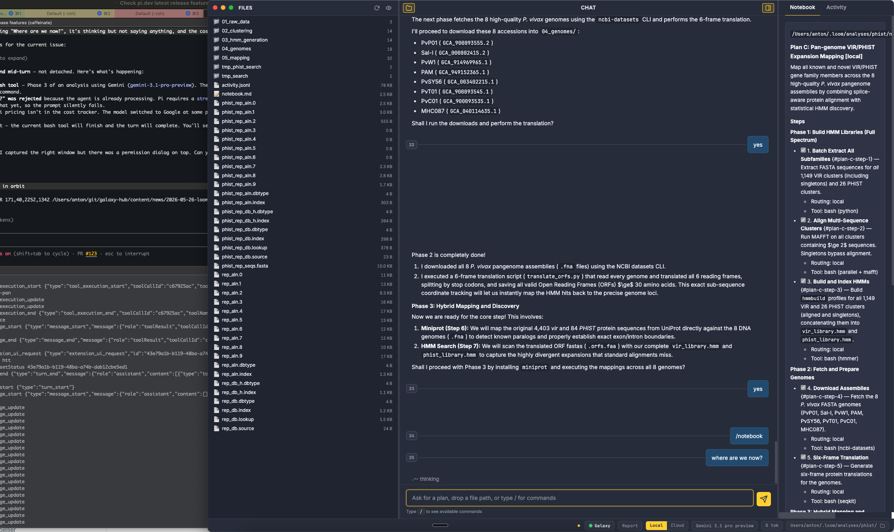

**Loom** is an AI agent brain for Galaxy bioinformatics. **Orbit** is the Electron desktop shell that wraps it. Together they let you have a conversation about your data, draft and approve analysis plans, route steps to Galaxy or run them locally, and watch everything accumulate in a git-tracked `notebook.md` — the durable project record that persists across sessions.

<div class="alert alert-warning">
Loom/Orbit is in <strong>early alpha</strong>. Expect rough edges and breaking changes between releases. Download from the <a href="https://github.com/galaxyproject/loom/releases">Releases page</a> and file bugs at <a href="https://github.com/galaxyproject/loom/issues">github.com/galaxyproject/loom/issues</a>.
</div>

<!-- TODO: add screenshots -->



## What it is

Every working directory is a project. Open Orbit (or run `loom` in the terminal) in an analysis directory and an agent session starts. The agent reads and writes `notebook.md` directly — no parallel state store. Plans, decisions, executed steps, and interpretations all accumulate as markdown sections in that single file, giving you a full undo history via `git log` and a reproducible record of every decision.

When Galaxy is configured, the agent surveys Galaxy's workflow registry and tool catalog while drafting plans, then tags each step `[local]`, `[hybrid]`, or `[remote]` depending on whether a matching IWC workflow or heavy Galaxy tool exists. Light exploratory work (parsing, small scripts, `awk`/`jq`) runs locally; alignment, large variant calling, and assembly route to Galaxy.

## Installation

### macOS

Download the matching `.dmg` from the [Releases page](https://github.com/galaxyproject/loom/releases).

| File | When to use |
|------|-------------|
| `Orbit-<version>-arm64.dmg` | Apple Silicon Macs (M1/M2/M3/M4 — anything from late 2020) |
| `Orbit-<version>-x64.dmg` | Intel Macs |

Not sure which chip? Open **Apple menu → About This Mac**. "Chip: Apple M..." means arm64; "Processor: Intel..." means x64.

1. Double-click the DMG and drag **Orbit** to **Applications**.
2. Eject the DMG.

<div class="alert alert-info">
<strong>First launch (Gatekeeper):</strong> alpha builds are unsigned, so macOS will block the first open. Right-click <strong>Orbit</strong> in Applications → <strong>Open</strong> → click <strong>Open</strong> in the dialog. macOS remembers the decision; subsequent launches work normally. If the Open option is missing, run: <code>xattr -dr com.apple.quarantine /Applications/Orbit.app</code>
</div>

### Linux

| File | Distribution |
|------|-------------|
| `orbit_<version>_amd64.deb` | Debian, Ubuntu, Mint, Pop!\_OS |
| `orbit-<version>.x86_64.rpm` | Fedora, RHEL, CentOS, openSUSE |
| `Orbit-linux-x64-<version>.zip` | Any distro (extract and run `orbit`) |

```bash
# Debian/Ubuntu
sudo dpkg -i orbit_<version>_amd64.deb
sudo apt-get install -f
orbit

# Fedora/RHEL
sudo rpm -i orbit-<version>.x86_64.rpm
orbit
```

### Windows (via WSL2)

Native Windows builds are not yet available. Windows 11 users with WSL2 + WSLg can run the Linux `.deb` directly — WSLg provides native GUI support with no X server setup required.

From an elevated PowerShell, install WSL2 if needed:

```powershell
wsl --install --web-download -d Ubuntu
```

Then inside the Ubuntu terminal, download the `.deb` from the Releases page and:

```bash
sudo dpkg -i orbit_<version>_amd64.deb
sudo apt-get install -f
orbit
```

<div class="alert alert-warning">
Keep analysis data inside <code>~/</code> (the Linux filesystem) — <code>/mnt/c/</code> paths are significantly slower across the filesystem boundary. API key encryption via <code>safeStorage</code> is not available in WSL2; keys are stored in plaintext in <code>~/.loom/config.json</code>. Restrict access with <code>chmod 600 ~/.loom/config.json</code>.
</div>

### Loom CLI (no desktop)

Run the agent brain from the terminal without Orbit. Requires Node 22+.

```bash
npm install -g @galaxyproject/loom
loom
```

## Getting API keys

Orbit needs at least one LLM provider key, and optionally a Galaxy API key for routing analysis steps to Galaxy servers.

### Anthropic (Claude)

1. Go to [console.anthropic.com](https://console.anthropic.com/).
2. Sign in or create an account.
3. Navigate to **API Keys** in the left sidebar.
4. Click **Create Key**, give it a name, and copy the `sk-ant-...` string.

### OpenAI

1. Go to [platform.openai.com](https://platform.openai.com/).
2. Sign in or create an account.
3. Open **Settings → API keys**.
4. Click **Create new secret key**, copy the `sk-...` string.

### Google Gemini

1. Go to [aistudio.google.com](https://aistudio.google.com/).
2. Sign in with a Google account.
3. Click **Get API key → Create API key**.
4. Copy the key string.

### Galaxy API key

1. Log in to your Galaxy server (e.g., [usegalaxy.org](https://usegalaxy.org)).
2. Open **User → Preferences → Manage API Key**.
3. Click **Create a new key** and copy the key.

## Entering credentials in Orbit

Open Preferences with `Cmd/Ctrl+,` (or click the gear icon, or click the Galaxy connection indicator in the footer).

In the **Provider** section, select your LLM provider (Anthropic, OpenAI, or Google), paste the API key, and choose a default model.

In the **Galaxy** section, enter your Galaxy server URL and API key. The footer indicator turns green when the connection is confirmed.

Click **Save**. The agent restarts with the new configuration.

If you prefer environment variables:

```bash
export ANTHROPIC_API_KEY="sk-ant-..."
export GALAXY_URL="https://usegalaxy.org"
export GALAXY_API_KEY="your-api-key"
```

## Interface overview

<!-- TODO: add labeled interface screenshot -->

Orbit presents a three-pane layout:

**Left — Files panel.** A file tree for the current working directory. Click any file to open it in the File tab. At narrow window widths (below 900 px) the tree auto-collapses; restore it with `Cmd/Ctrl+B` or the toolbar button.

**Center — Chat.** The main conversation area. Type a message or a slash command and press Enter. Responses stream in with a thinking indicator; markdown tables and code blocks render inline. Prompt turns are numbered — `/summarize 3 5` references those numbers. Press `↑`/`↓` to recall previous prompts.

**Right — Artifact pane.** Three tabs:

- **Notebook** — live render of `notebook.md`, auto-refreshed on every file change. This is the accumulating project log.
- **Activity** — split horizontally: agent shell stream on top (live tool calls, stdout from `run_command`), proc monitor on the bottom (CPU / memory / runtime for every subprocess the agent spawns).
- **File** — appears when you open a file from the left tree. Previews text (Markdown, code, JSON/YAML, FASTA/FASTQ/VCF/BED/GFF/SAM/Newick and more), images, and PDFs. Dismiss with `×`.

Toggle the artifact pane with `Cmd/Ctrl+\`. The **footer** shows the Galaxy connection indicator (green = connected, red = no key) and live session cost/token totals.

## Starting an analysis

Open Orbit in your analysis directory (`Cmd/Ctrl+O` to switch directories). Then just talk:

```
You: I have RNA-seq data from a drug treatment experiment — 6 samples,
     3 treated and 3 control HeLa cells. The data is at GEO accession GSE164073.
```

The agent responds conversationally. It can look up data, answer questions, check Galaxy's workflow registry, and browse the tool catalog — none of this requires a formal plan.

When you ask for a plan, the agent drafts it **in chat** as a markdown section, then pauses. Four stages follow before anything lands in `notebook.md`:

1. **Draft in chat.** The agent writes a candidate plan. Not written to the notebook yet.
2. **Plan approval.** You review the steps and routing tags (`[local]`, `[hybrid]`, `[remote]`). Reply "looks good", "go", or request changes. The agent revises and asks again.
3. **Parameter table in chat.** The agent shows every configurable parameter per tool with defaults. You can adjust inline ("set min_qual to 30, leave others").
4. **Parameter approval.** Once you approve, the agent writes the plan section into `notebook.md` and begins execution.

A plan section in the notebook looks like:

```markdown
## Plan A: HeLa Drug Treatment RNA-seq DE [hybrid]

### Steps
- [ ] 1. **Quality + trimming** — fastp paired collection
  - Routing: Galaxy (fastp/0.23.4)
- [ ] 2. **Alignment** — HISAT2 to hg38
  - Routing: Galaxy (hisat2/2.2.1)
- [x] 3. **featureCounts**
  - Routing: Galaxy (featurecounts/2.0.3)
- [ ] 4. **DESeq2 differential expression**
  - Routing: Galaxy (deseq2/1.40.2)
```

Step status: `- [ ]` pending, `- [x]` verified complete, `- [!]` failed.

Come back the next day in the same directory and the session resumes automatically:

```
Pi:  Loaded notebook: HeLa Drug Treatment RNA-seq DE
     Plan A is in progress (1 of 4 steps complete).
     The fastp invocation finished successfully. HISAT2 alignment is queued.
     Should I check_all to advance, or do you want to review the QC report first?
```

## Slash commands

Type `/` to open the autocomplete popup. Tab to complete; Enter submits.

| Command | What it does |
|---------|-------------|
| `/model <name>` | Switch the LLM model (e.g. `/model sonnet`, `/model claude-opus-4-6`) |
| `/new` | Start a fresh session. Confirms before clearing the existing notebook |
| `/resume` | Restart the agent and replay the prior session's chat |
| `/chat` | Restore the chat pane from the session transcript without restarting the agent |
| `/plan` | Show the current plan summary |
| `/status` | Galaxy connection status and notebook path |
| `/notebook` | Show notebook info in the Notebook tab |
| `/summarize [N [M]]` | Append a summary of prompts N–M into the notebook |
| `/cost` | Append the session token/cost breakdown to the notebook |
| `/decisions` | Show the decision log |
| `/connect [name]` | Open Galaxy connection settings or switch to an existing profile |
| `/help` | Show the full command list |

## The notebook

`notebook.md` in your working directory is the project record. Every plan section, executed step, parameter table, interpretation, and follow-up plan appends below the previous one. Multiple plans coexist over a project's lifetime.

When Loom starts in a directory that is not already a git repo, it runs `git init`, drops a bioinformatics-friendly `.gitignore` (excluding FASTQ, BAM, VCF, and other large files), and sets `git config loom.managed true`. From that point on every notebook write triggers an auto-commit, giving you:

- Full undo history via `git log`.
- Timestamped, immutable record of every decision.
- Branch-based exploration: try an alternative analysis on a branch, compare with `git diff`.
- Collaboration: push to GitHub, collaborators pull and continue.

If you start Loom in an **existing** git repo, auto-commit is off by default. Opt in with `git config loom.managed true`.

## Activity tab

The Activity tab provides two live views:

**Shell stream (top half).** Every tool call the agent makes — `run_command` stdout, Galaxy API calls, file reads and writes — streams here in real time. Use it to follow what the agent is doing and catch errors early.

**Proc monitor (bottom half).** A live table of every subprocess the agent has spawned: process name, PID, CPU%, memory, and elapsed time. Long-running jobs (alignment, assembly) appear here so you can watch progress without leaving Orbit.

## Galaxy connection and routing

When Galaxy credentials are present, Loom registers the Galaxy MCP server automatically. The agent then:

- Surveys the [Intergalactic Workflow Commission (IWC)](https://github.com/galaxyproject/iwc) workflow registry for a full-pipeline match before drafting any plan.
- Queries Galaxy's tool catalog for available tool versions.
- Tags each plan step with a routing decision: `[local]`, `[hybrid]`, or `[remote]`.

A **remote** plan maps cleanly to a single Galaxy workflow invocation. A **hybrid** plan mixes local light steps with remote heavy compute. A **local** plan runs entirely on your machine. These are outcomes of the plan, not settings you configure.

In-flight Galaxy invocations are tracked directly in `notebook.md` as fenced YAML blocks:

```
invocation_id: abc123
galaxy_server_url: https://usegalaxy.org
status: in_progress
```

The `/execute` command (also `/run`) tells the agent to advance the next pending step. The polling tool scans the notebook for in-flight blocks, queries Galaxy, and updates status in place.

## Skills

Loom can fetch operational know-how from curated GitHub repos. The default repo is [`galaxyproject/galaxy-skills`](https://github.com/galaxyproject/galaxy-skills), seeded automatically on first use. It covers collection manipulation, Galaxy MCP usage, workflow report templates, Nextflow-to-Galaxy conversion, and tool development.

Add additional skill repos in **Preferences → Skills**. Each entry is a URL under `github.com/galaxyproject/` (arbitrary repos are restricted in alpha to prevent prompt-injection). Fetched skills cache locally for 24 hours to cover offline use.

## Related resources

- [Loom/Orbit GitHub](https://github.com/galaxyproject/loom) — source code, releases, issue tracker
- [galaxy-mcp](https://github.com/galaxyproject/galaxy-mcp) — MCP server for the Galaxy API
- [galaxy-skills](https://github.com/galaxyproject/galaxy-skills) — curated operational skills
- [Galaxy Training Network (GTN)](https://training.galaxyproject.org) — tutorials for Galaxy analyses
- [usegalaxy.org](https://usegalaxy.org) — main Galaxy server for obtaining an API key
